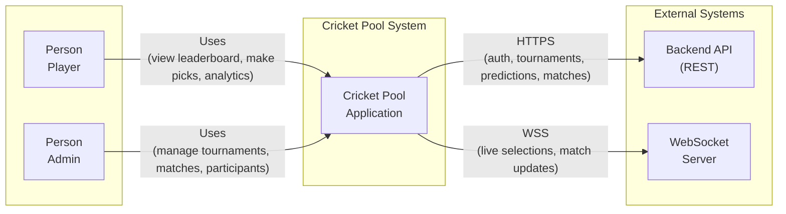

# C4 Level 1 – System Context

Describes the **Cricket Pool** system boundary and its relationships with **users** and **external systems**. No internal structure yet.

## System Context Diagram

## Elements

### People (actors)

| Actor | Description |
|-------|-------------|
| **Player** | Registered user who joins tournaments, makes match predictions, views leaderboard and analytics. |
| **Admin** | User with admin role; manages tournaments, matches, participants, and live-feed config. |

### Software system

| System | Description |
|--------|-------------|
| **Cricket Pool Application** | The product: fantasy cricket pool where users pick match winners, earn points, and compete on tournament leaderboards. This document set focuses on the **web frontend** (Angular SPA) as the primary user-facing part; backend is treated as an external system. |

### External systems

| System | Description |
|--------|-------------|
| **Backend API (REST)** | REST API over HTTPS. Handles auth, tournaments, matches, predictions, leaderboard, pool analytics. Base URL from `environment.apiUrl`. See [BACKEND_CONTRACT.md](./BACKEND_CONTRACT.md). |
| **WebSocket Server** | Real-time channel for live selection events and match updates. Used by the Selections Feed and dashboard notifications. Configured when `environment.enableWebSockets` is true. |

## Key Interactions

| From | To | Interaction |
|------|-----|-------------|
| Player | Cricket Pool Application | Sign in, view leaderboard, select tournament, make picks, view own analytics and history. |
| Admin | Cricket Pool Application | Sign in, manage tournaments and participants, create/update matches, set winners, configure live feed. |
| Cricket Pool Application | Backend API | All data: auth, tournaments, matches, predictions, leaderboard, analytics, pool stats. |
| Cricket Pool Application | WebSocket Server | Subscribe to live selections and match updates; display in Selections Feed and dashboard. |

## Out of Scope (for this level)

- Internal structure of the web app (see Level 2 – Containers).
- Internal structure of the backend (separate codebase).
- Deployment topology (e.g. Vercel, CDN, API host).
