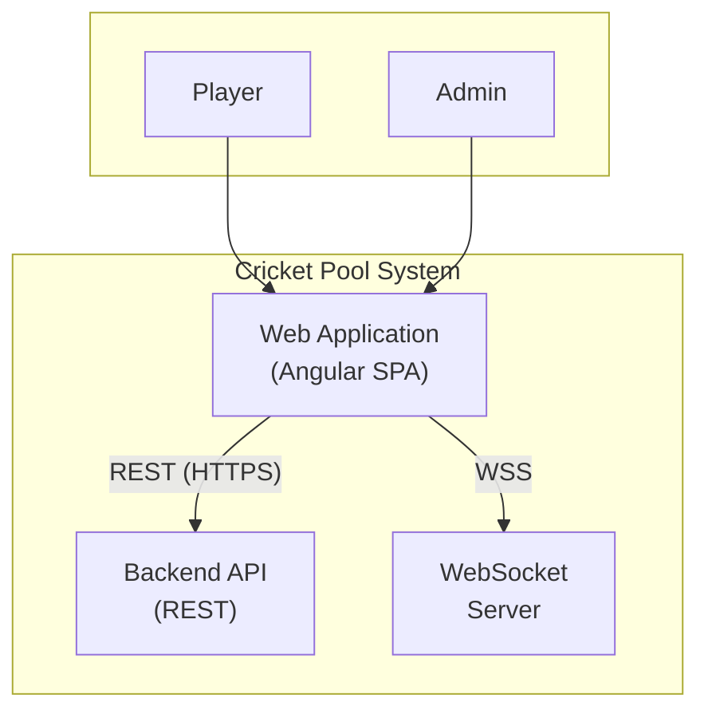

# C4 Level 2 – Containers

Zooms into the **Cricket Pool** system and shows its main **containers**: runnable or deployable applications/services. This level does not show internal modules or classes.

## Container Diagram

## Containers (high level)

| Container | Technology | Responsibility | Repo / ownership |
|-----------|------------|----------------|------------------|
| **Web Application** | Angular 20, single-page app | UI for sign-in/up, dashboard, leaderboard, analytics, selections feed, admin and tournament management. Runs in the browser; calls Backend API and WebSocket. | This repo (`fantacyPool-ui`). Deployed e.g. Vercel. |
| **Backend API** | REST over HTTPS | Auth, tournaments, matches, predictions, leaderboard, pool analytics, participants. JWT-based auth. | Separate backend repo; see [BACKEND_CONTRACT.md](./BACKEND_CONTRACT.md). |
| **WebSocket Server** | WebSocket (STOMP) | Live push: new selections, match updates. Subscribed to by the Web Application for real-time feed and notifications. | Typically same backend deployment; may be same or separate process. |

## Web Application (this repo) – summary

- **Single deployable:** One Angular app; no server-side rendering in this repo.
- **Entry:** `index.html` → Angular bootstrap → router; routes define which screen (signin, dashboard, leaderboard, etc.).
- **Configuration:** `environment.apiUrl`, `environment.enableWebSockets`, `environment.features.analytics` (feature toggle).
- **Communication:**
  - **Backend API:** All HTTP via `HttpClient` (auth, tournaments, matches, predictions, analytics). JWT sent via `AuthInterceptor`.
  - **WebSocket:** `WebSocketService` (STOMP over SockJS) for live selections and match updates.

## Backend API – summary (external)

- **REST:** Base URL from frontend `environment.apiUrl` (e.g. `https://api.example.com`).
- **Auth:** Sign-in returns JWT; frontend stores and sends it on subsequent requests.
- **Key domains:** Users, tournaments, participants, matches, predictions, leaderboard, pool analytics. See [BACKEND_CONTRACT.md](./BACKEND_CONTRACT.md).

## WebSocket Server – summary (external)

- **Protocol:** STOMP over WebSocket (SockJS fallback).
- **Topics:** e.g. `/topic/selections`, match updates; frontend subscribes in `WebSocketService` and pushes events into `matchUpdates$` / selection streams for the Selections Feed and dashboard.

## What we don’t show at this level

- **Inside Web Application:** Routes, services, guards, feature modules (see Level 3 – Components).
- **Inside Backend:** Services, databases, queues (separate backend docs/codebase).
