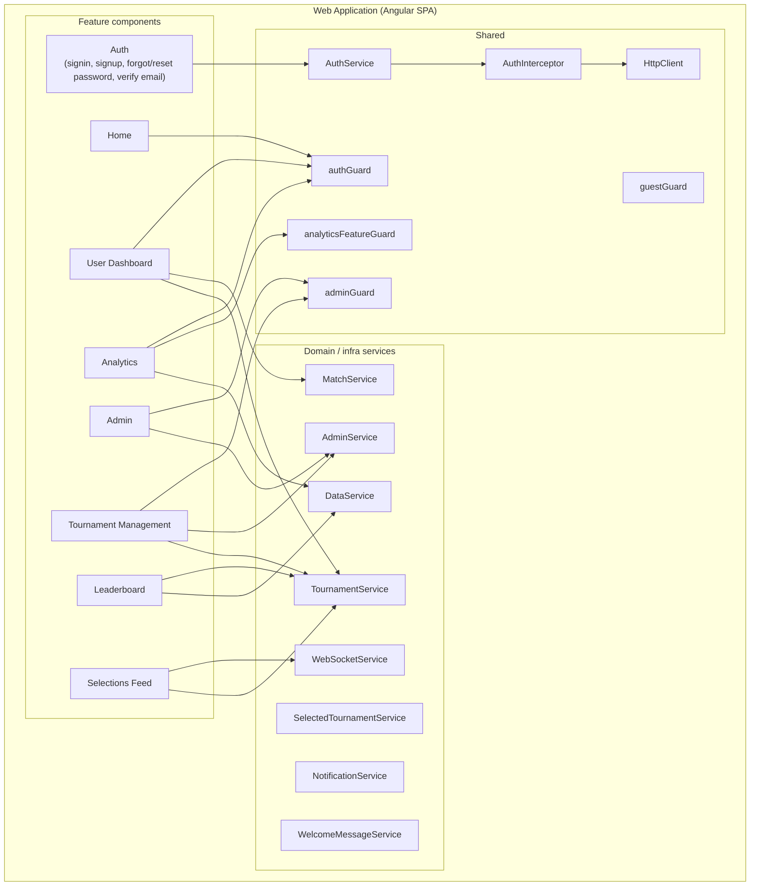

# C4 Level 3 – Components (Web Application)

Zooms into the **Web Application** container and describes its main **components**: feature areas (route-level) and shared services/guards. No class-level or file-level detail.

## Component Diagram

## Feature components (by route)

| Component | Route(s) | Guards | Responsibility |
|-----------|----------|--------|----------------|
| **Auth** | `signin`, `signup`, `forgot-password`, `reset-password`, `verify-email` | `guestGuard` (signed-in users redirected) | Login, registration, password reset, email verification. Uses `AuthService`. |
| **Email verified** | `verify-email` | — | Post-verification landing. |
| **Home** | `home` | `authGuard` | Authenticated landing; entry to dashboard and navigation. |
| **User Dashboard** | `user-dashboard` | `authGuard` | Tournament selection, match list, make/change picks, view own history. Uses `MatchService`, `TournamentService`, `SelectedTournamentService`. |
| **Leaderboard** | `leaderboard` | — | Public or tournament-scoped leaderboard. Uses `TournamentService`, `DataService`. |
| **Selections Feed** | `selections-feed` | — | Live feed of user selections; real-time via `WebSocketService`, tournament context via `TournamentService`. |
| **Analytics** | `analytics` | `authGuard`, `analyticsFeatureGuard` | Pool analytics (when feature enabled). Uses `DataService`. |
| **Admin** | `admin` | `adminGuard` | Admin landing and navigation. Uses `AdminService`. |
| **Tournament Management** | `tournament-management` | `adminGuard` | Create/edit tournaments, manage participants, create matches, set winners. Uses `AdminService`, `TournamentService`. |

Default route: `**` → redirect to `/signin`.

## Shared components and cross-cutting concerns

| Component | Type | Responsibility |
|-----------|------|----------------|
| **AuthService** | Service | Sign-in/up, logout, token storage, current user; used by auth screens and guards. |
| **AuthInterceptor** | HTTP interceptor | Attaches JWT to outgoing API requests; handles 401. |
| **authGuard** | Route guard | Requires authenticated user; else redirect to signin. |
| **adminGuard** | Route guard | Requires authenticated admin; else redirect. |
| **analyticsFeatureGuard** | Route guard | Requires analytics feature enabled (`environment.features.analytics`); else redirect. |
| **guestGuard** | Route guard | Redirects already-signed-in users away from signin/signup/forgot-password/reset-password. |

## Domain and infrastructure services

| Service | Responsibility |
|---------|----------------|
| **MatchService** | Match list, match details, submit/update predictions (calls Backend API). |
| **TournamentService** | List/active tournaments, tournament by ID (calls Backend API). |
| **AdminService** | Admin-only operations: tournaments CRUD, participants, matches, set winner (calls Backend API). |
| **SelectedTournamentService** | In-memory selected tournament context for dashboard/leaderboard/feed. |
| **DataService** | Leaderboard and pool analytics data (calls Backend API). |
| **WebSocketService** | STOMP over SockJS; subscriptions for live selections and match updates; exposes streams for Selections Feed and notifications. |
| **NotificationService** | In-app notifications (e.g. toast); may consume WebSocket events. |
| **WelcomeMessageService** | Fetch/display welcome or banner message (Backend API or config). |

## Data flow (summary)

- **Auth:** User credentials → AuthService → Backend API → JWT stored; AuthInterceptor adds JWT to all API calls.
- **Dashboard / picks:** User selects tournament (SelectedTournamentService); MatchService loads matches and submits predictions to Backend API.
- **Leaderboard / analytics:** TournamentService + DataService load leaderboard and analytics from Backend API.
- **Selections feed:** WebSocketService subscribes to live topic; events rendered in Selections Feed; tournament filter via SelectedTournamentService / TournamentService.
- **Admin / tournament management:** AdminService and TournamentService call Backend API for CRUD and participant/match management.

## References

- Routes: `src/app/app.routes.ts`
- Guards: `src/app/auth.guard.ts`, `src/app/admin.guard.ts`, `src/app/analytics-feature.guard.ts`, `src/app/guest.guard.ts`
- Backend contract: [BACKEND_CONTRACT.md](./BACKEND_CONTRACT.md)
- Tournament-scoped features: [ARCHITECTURE_TOURNAMENT_SCOPED_FEATURES.md](./ARCHITECTURE_TOURNAMENT_SCOPED_FEATURES.md)
