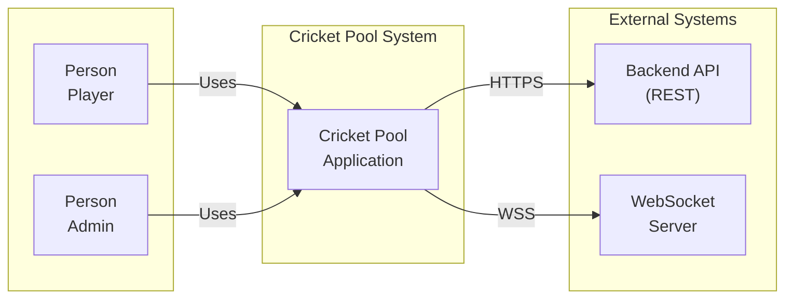
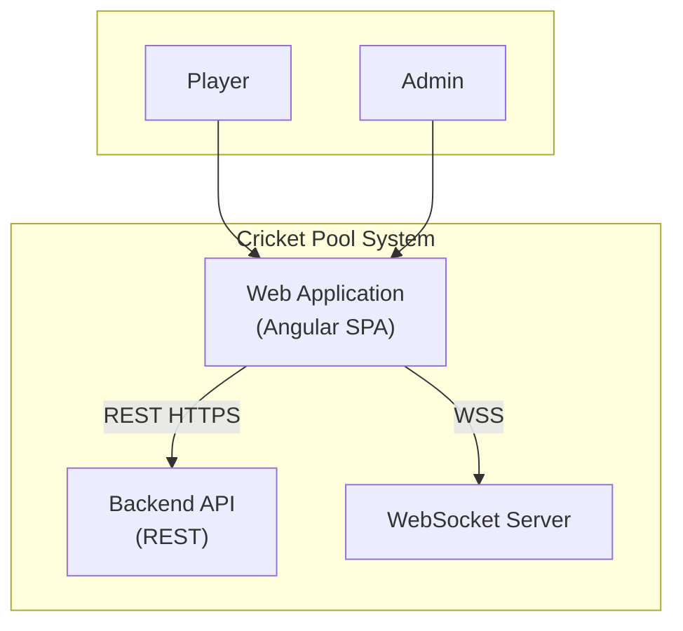
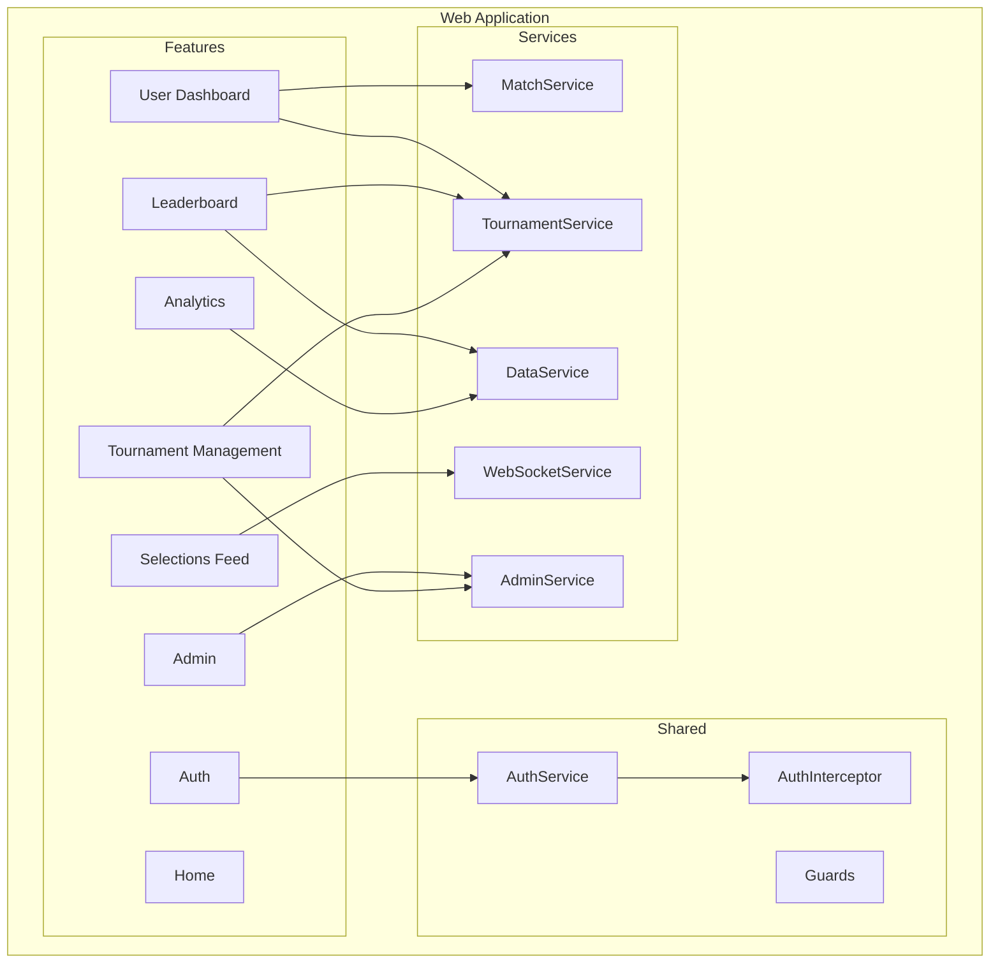

# Cricket Pool – System Design Document

This document describes the **Cricket Pool** (Fantasy Pool) system end-to-end: product purpose, architecture (C4 model), technology choices, security, key flows, API integration, and configuration. It consolidates and expands the C4-level docs and references existing backend/architecture docs for full detail.

---

## 1. Product Overview

### 1.1 Purpose

**Cricket Pool** is a fantasy cricket application where:

- **Players** register, sign in, and enroll in **tournaments**. For each tournament they see **upcoming matches**, make **predictions** (pick the winning team), and earn **points** when the admin sets the match winner. They view **leaderboards** (per tournament) and optional **analytics** (their history and pool-wide stats).
- **Admins** create and manage **tournaments**, add/remove **participants**, create **matches**, set **winners**, and optionally configure a **live selections feed**.

All leaderboard, matches, and history are **scoped per tournament**. Participation in a tournament is **admin-controlled** (admin adds users to a tournament); only participants can see that tournament’s matches, make picks, and appear on its leaderboard.

### 1.2 Main Capabilities

| Area | Description |
|------|-------------|
| **Authentication** | Sign up, sign in, forgot password, reset password, email verification. JWT-based session. |
| **User dashboard** | Select a tournament (from enrolled list), view upcoming matches, submit/change picks, view match history and points for that tournament. |
| **Leaderboard** | View per-tournament leaderboard (points, rank). Optional: expand a user to see their prediction history for that tournament. |
| **Selections feed** | Live feed of user selections (who picked which team); real-time via WebSocket, optional tournament filter. |
| **Analytics** | When feature is enabled: “My analytics” (own history/points) and “Pool analytics” (aggregate stats per match / pool). |
| **Admin** | Admin landing and navigation. |
| **Tournament management** | Create/edit/delete tournaments, manage participants (add/remove users), create/update matches, set match winner. |

---

## 2. Architecture Overview (C4 Model)

The system is described in three levels: **Context** (system boundary), **Containers** (main applications), and **Components** (inside the web app). Level 4 (code/classes) is omitted.

### 2.1 Level 1 – System Context

**Actors:** Player, Admin  
**System:** Cricket Pool Application (the product)  
**External systems:** Backend API (REST), WebSocket Server

- **Player:** Uses the app to sign in, view leaderboard, select tournament, make picks, view analytics/history.
- **Admin:** Uses the app to manage tournaments, participants, matches, and set winners.
- **Backend API:** All persistent data and business logic (auth, tournaments, matches, predictions, leaderboard, analytics). Consumed over HTTPS; base URL from `environment.apiUrl`.
- **WebSocket Server:** Real-time push (live selections, match updates). Used by Selections Feed and optional notifications.

### 2.2 Level 2 – Containers

Inside the **Cricket Pool** system there are three deployable/runnable parts:

| Container | Technology | Responsibility |
|-----------|------------|----------------|
| **Web Application** | Angular 20, SPA | All UI: auth, dashboard, leaderboard, selections feed, analytics, admin, tournament management. Runs in the browser; calls Backend API and WebSocket. **This repo.** |
| **Backend API** | REST over HTTPS | Auth, users, tournaments, participants, matches, predictions, leaderboard, pool analytics. JWT auth. **External.** |
| **WebSocket Server** | STOMP over WebSocket (SockJS) | Live events for selections and match updates. **External** (often same deployment as backend). |

### 2.3 Level 3 – Components (Web Application)

Inside the **Web Application** container:

- **Feature components (routes):** Auth (signin, signup, forgot/reset password, verify email), Home, User Dashboard, Leaderboard, Selections Feed, Analytics, Admin, Tournament Management.
- **Shared:** AuthService, AuthInterceptor, route guards (authGuard, adminGuard, analyticsFeatureGuard, guestGuard).
- **Domain/infra services:** MatchService, TournamentService, AdminService, SelectedTournamentService, DataService, WebSocketService, NotificationService, WelcomeMessageService.

Detailed component tables, routes, and guards are in [C4_03_Components.md](./C4_03_Components.md).

---

## 3. Technology Stack

### 3.1 Frontend (this repo)

| Layer | Technology |
|-------|------------|
| **Framework** | Angular 20 |
| **Language** | TypeScript |
| **Build** | Angular CLI (esbuild) |
| **HTTP** | `HttpClient` (REST), `AuthInterceptor` for JWT |
| **Real-time** | STOMP over SockJS (`WebSocketService`) |
| **Routing** | Angular Router; guards for auth, admin, feature flags |
| **State** | In-memory (e.g. `SelectedTournamentService`), no global store |
| **Auth storage** | `localStorage` (token, user_details) |

### 3.2 Backend (external)

- **API:** REST over HTTPS; base URL configurable (`environment.apiUrl`).
- **Auth:** JWT in response (e.g. signin/signup); frontend sends `Authorization: Bearer <token>`.
- **WebSocket:** STOMP over SockJS; endpoint typically derived from API base URL.

### 3.3 Configuration (environment)

| Key | Purpose |
|-----|---------|
| `apiUrl` | Backend API base (e.g. `http://localhost:8080`, production API URL). |
| `enableWebSockets` | Whether to connect to WebSocket server (e.g. for Selections Feed). |
| `features.analytics` | Feature toggle for Analytics route; when false, `analyticsFeatureGuard` blocks access. |

Files: `src/environments/environments.ts` (dev), `src/environments/environments.prod.ts` (prod). Build uses the appropriate file via `fileReplacements`.

---

## 4. Security

### 4.1 Authentication

- **Sign-in:** POST credentials to `/api/auth/signin`; backend returns JWT (and optionally user details). Frontend stores token and user details in `localStorage` and updates `AuthService.authStatus$`.
- **Token usage:** `AuthInterceptor` attaches `Authorization: Bearer <token>` to every outgoing API request. If backend returns 401, frontend can clear token and redirect to signin.
- **Token validation:** Frontend checks JWT expiry on app load and when checking `isAuthenticated()`; expired token triggers logout (clear storage, redirect).
- **Sign-up / forgot-password / reset-password:** POST to backend; email verification and reset links are backend-driven.

### 4.2 Authorization (route guards)

| Guard | Applied to | Behavior |
|-------|------------|----------|
| **authGuard** | home, user-dashboard, analytics | Must be authenticated; else redirect to `/signin`. |
| **adminGuard** | admin, tournament-management | Must be authenticated and admin (e.g. role from JWT/user); else redirect. |
| **analyticsFeatureGuard** | analytics | Requires `environment.features.analytics === true`; else redirect. |
| **guestGuard** | signin, signup, forgot-password, reset-password | If already authenticated, redirect away (e.g. to home) so logged-in users cannot see auth pages. |

### 4.3 Backend responsibility

- Backend enforces authorization for every endpoint (e.g. only participants can read a tournament’s matches and leaderboard; only admin can set winner or manage participants). Frontend guards only control which UI routes are visible; they do not replace server-side checks.

---

## 5. Key User Flows

### 5.1 Authentication flow

1. User opens app → default route redirects to `/signin`.
2. User enters credentials → `AuthService.signin()` → POST `/api/auth/signin`.
3. Backend returns JWT (and optionally user details). Frontend stores token and user details, sets auth status.
4. `AuthInterceptor` adds JWT to all subsequent API requests.
5. Navigate to `/home` (or dashboard). `authGuard` allows access because user is authenticated.
6. Logout: `AuthService.logout()` clears `localStorage` and auth status; user can be redirected to signin.

### 5.2 Player – Dashboard and picks

1. User goes to **User Dashboard** (`/user-dashboard`), protected by `authGuard`.
2. Frontend loads enrolled tournaments (e.g. `GET /api/tournaments/enrolled`). User selects a tournament; selection is stored in `SelectedTournamentService`.
3. Upcoming matches: `GET /api/tournaments/:id/matches`. User makes or changes a pick → POST/PUT to predictions API (e.g. `POST /api/predictions` with `{ matchId, team }`).
4. Match history and points for selected tournament: e.g. `GET /api/predictions/me/history?tournamentId=:id`. All data is tournament-scoped.

### 5.3 Leaderboard

1. User opens **Leaderboard** (`/leaderboard`). No auth required (or optional: “my tournaments” vs “all”).
2. Tournament selector lists tournaments (enrolled or all, depending on product). On select, `GET /api/tournaments/:id/leaderboard` loads that tournament’s leaderboard.
3. Optional: expand a row → `GET /api/predictions/users/:username/history?tournamentId=:id` for that user’s history in that tournament.

### 5.4 Selections feed (real-time)

1. User opens **Selections Feed** (`/selections-feed`). Optional tournament filter from `SelectedTournamentService` or selector.
2. `WebSocketService` connects (if `enableWebSockets` is true) and subscribes to live selection (and optionally match update) topics.
3. Incoming messages are pushed into Observables; Selections Feed component subscribes and renders events. Optional REST fallback: e.g. `GET /api/predictions/selections?tournamentId=&limit=&page=` for initial or paginated list.

### 5.5 Admin – Tournament management

1. Admin signs in and goes to **Tournament Management** (`/tournament-management`), protected by `adminGuard`.
2. List tournaments (e.g. `GET /api/tournaments`), create/edit/delete via AdminService.
3. Per tournament: manage participants (`GET /api/tournaments/:id/participants`, `PUT /api/tournaments/:id/participants` with `userIds` or add/remove endpoints), create/update matches, set winner (`PUT /api/matches/:id/winner` with `{ winner }`).

### 5.6 Analytics

1. User goes to **Analytics** (`/analytics`), protected by `authGuard` and `analyticsFeatureGuard` (feature must be on).
2. “My analytics”: from `GET /api/predictions/me/history?tournamentId=` (and optionally tournament selector). Frontend may compute aggregates or use a dedicated analytics endpoint if available.
3. “Pool analytics”: `GET /api/tournaments/:tournamentId/pool-analytics` for per-match and pool-wide stats. If backend does not support it, UI shows a message that pool analytics will appear when the backend supports it.

---

## 6. API Integration

### 6.1 REST API (summary)

Base URL: `environment.apiUrl`. All endpoints below are relative to that base. JWT is sent via `AuthInterceptor`.

| Area | Methods / endpoints (representative) |
|------|-------------------------------------|
| **Auth** | POST `/api/auth/signin`, `/api/auth/signup`, `/api/auth/forgot-password`, `/api/auth/reset-password` |
| **Users** | GET `/api/users/:username` (profile) |
| **Tournaments** | GET `/api/tournaments`, `/api/tournaments/enrolled`, `/api/tournaments/:id`; GET/POST/PUT/DELETE for admin |
| **Matches** | GET `/api/tournaments/:id/matches`; admin: create/update; PUT `/api/matches/:id/winner` |
| **Participants** | GET/PUT `/api/tournaments/:id/participants` (admin) |
| **Predictions** | GET `/api/predictions/me/history?tournamentId=`, GET `/api/predictions/mine`, POST `/api/predictions`; GET `/api/predictions/users/:username/history?tournamentId=` |
| **Leaderboard** | GET `/api/tournaments/:id/leaderboard` |
| **Analytics** | GET `/api/tournaments/:tournamentId/pool-analytics` |
| **Selections feed** | GET `/api/predictions/selections?limit=&page=&tournamentId=`, GET `/api/matches/:id/selections` (optional) |

Full request/response and optional endpoints are in [BACKEND_CONTRACT.md](./BACKEND_CONTRACT.md). Additional detail: [BACKEND_API_PREDICTIONS_AND_WINNER.md](./BACKEND_API_PREDICTIONS_AND_WINNER.md), [BACKEND_API_TOURNAMENT_PARTICIPANTS.md](./BACKEND_API_TOURNAMENT_PARTICIPANTS.md), [BACKEND_API_ANALYTICS.md](./BACKEND_API_ANALYTICS.md), [BACKEND_API_PER_TOURNAMENT_VIEWS.md](./BACKEND_API_PER_TOURNAMENT_VIEWS.md), [BACKEND_API_LIVE_FEED_AND_MATCH_SELECTIONS.md](./BACKEND_API_LIVE_FEED_AND_MATCH_SELECTIONS.md).

### 6.2 WebSocket

- **Protocol:** STOMP over SockJS (fallback for environments where raw WebSocket is blocked).
- **Usage:** `WebSocketService` connects to the WebSocket server (URL typically derived from `apiUrl`), subscribes to topics (e.g. selections, match updates), and exposes streams (e.g. `matchUpdates$`) for the Selections Feed and notifications.
- **Feature flag:** When `environment.enableWebSockets` is false, the app does not connect; Selections Feed can still use REST if available.

---

## 7. Data Model and Domain Concepts

(Backend is the source of truth; below is the frontend’s view of the domain.)

| Concept | Description |
|---------|-------------|
| **User** | Registered user; has username, credentials, optional firstName, lastName, email, role (e.g. admin). |
| **Tournament** | A competition; has name, status, etc. Users participate only if added as participants (admin-managed). |
| **Participant** | A user enrolled in a tournament; enrollment is managed by admin (add/remove). |
| **Match** | A match within a tournament (team A vs team B, start time, etc.). Admin sets winner after the match. |
| **Prediction** | A user’s pick for a match (chosen team). One prediction per user per match; can be updated until some cutoff. |
| **Points** | Awarded when admin sets match winner; computed per tournament for leaderboard and history. |
| **Leaderboard** | Per-tournament ranking of participants by points. |
| **Pool analytics** | Aggregate stats for a tournament (e.g. picks by team, correct/wrong counts, points over time). |

Tournament-scoped design (per-tournament leaderboard, matches, history, participants) is described in [ARCHITECTURE_TOURNAMENT_SCOPED_FEATURES.md](./ARCHITECTURE_TOURNAMENT_SCOPED_FEATURES.md).

---

## 8. Configuration and Deployment

### 8.1 Build and serve

- **Dev:** `ng serve` (or `npm run start`) uses `environments.ts`; default `apiUrl` often `http://localhost:8080`.
- **Prod:** Build uses `environments.prod.ts` (e.g. `ng build --configuration production`); set `apiUrl` (and optionally WebSocket URL) to production API.

### 8.2 Environment variables

- Angular environment files are replaced at build time (no runtime env vars by default). For multiple environments, add more config files and corresponding build configurations.
- Sensitive data (e.g. API keys) must not be committed; use backend-owned auth (e.g. JWT) and keep production URLs in environment files that are not committed or are overridden in CI/CD.

### 8.3 Deployment (frontend)

- The app is a static SPA: build output can be deployed to any static host (e.g. Vercel, Netlify, S3 + CloudFront, nginx). Default route and client-side routes must resolve to `index.html` (e.g. history fallback).
- CORS must allow the frontend origin for the Backend API and (if used) WebSocket server.

---

## 9. Document Index and References

| Document | Content |
|----------|---------|
| [C4_OVERVIEW.md](./C4_OVERVIEW.md) | Index of C4 levels and how to read diagrams. |
| [C4_01_Context.md](./C4_01_Context.md) | Level 1 – System context (actors, system, external systems). |
| [C4_02_Containers.md](./C4_02_Containers.md) | Level 2 – Containers (Web App, Backend API, WebSocket). |
| [C4_03_Components.md](./C4_03_Components.md) | Level 3 – Components (routes, services, guards). |
| [BACKEND_CONTRACT.md](./BACKEND_CONTRACT.md) | API contract: endpoints required/optional for the frontend. |
| [ARCHITECTURE_TOURNAMENT_SCOPED_FEATURES.md](./ARCHITECTURE_TOURNAMENT_SCOPED_FEATURES.md) | Tournament-scoped features, admin-managed participants, per-tournament views. |
| [BACKEND_API_*.md](./BACKEND_API_PREDICTIONS_AND_WINNER.md) | Detailed API docs: predictions, winner, participants, analytics, per-tournament views, live feed. |

---

## 10. Summary

- **Cricket Pool** is a tournament-scoped fantasy cricket app: players make match predictions and compete on per-tournament leaderboards; admins manage tournaments, participants, matches, and winners.
- **Architecture:** One Angular SPA (this repo) plus external Backend API and WebSocket server; C4 Context/Containers/Components describe the system and the web app structure.
- **Security:** JWT-based auth, token in `localStorage`, `AuthInterceptor` for API calls, route guards for auth and admin and feature flags; backend enforces authorization.
- **Key flows:** Auth, tournament selection and picks on dashboard, per-tournament leaderboard and history, real-time selections feed via WebSocket, admin tournament management, optional analytics with feature toggle.
- **Configuration:** `apiUrl`, `enableWebSockets`, `features.analytics` in environment files; build-time replacement for prod.

For full endpoint details and request/response shapes, use [BACKEND_CONTRACT.md](./BACKEND_CONTRACT.md) and the BACKEND_API_* docs; for UX and backend expectations around tournaments and participants, use [ARCHITECTURE_TOURNAMENT_SCOPED_FEATURES.md](./ARCHITECTURE_TOURNAMENT_SCOPED_FEATURES.md).
